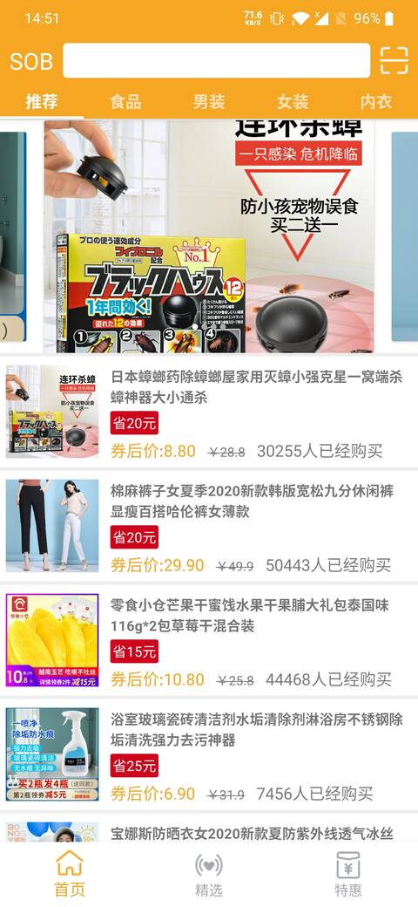
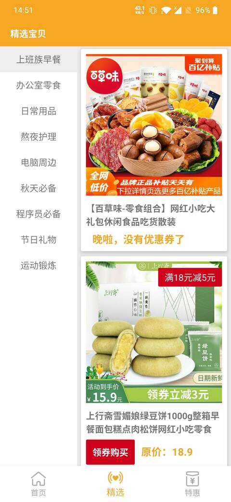
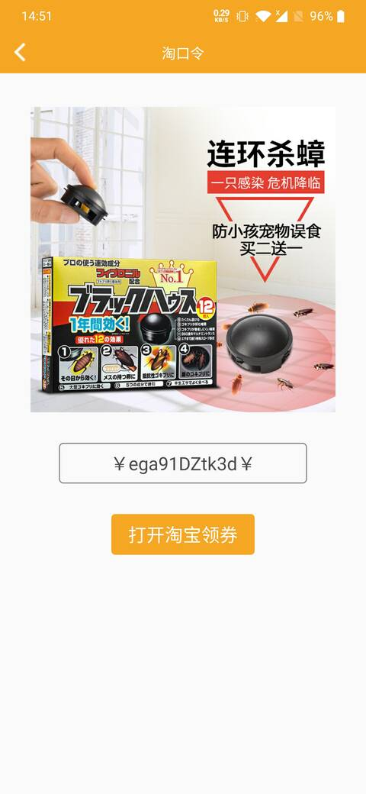
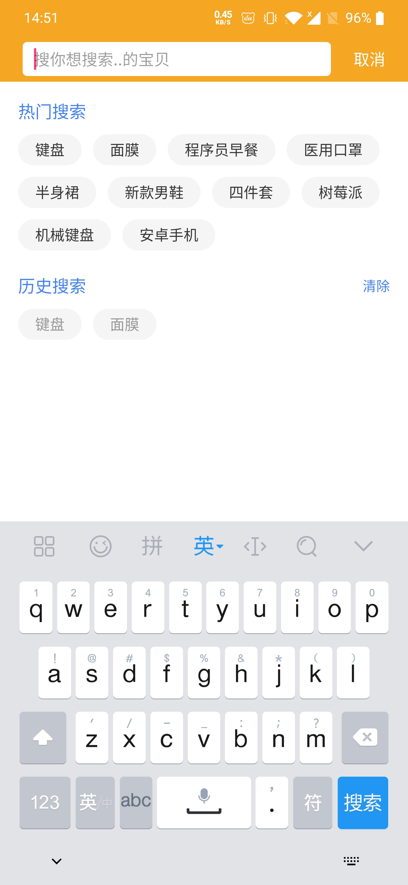
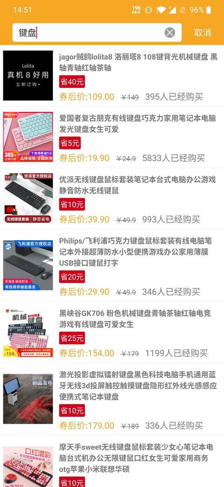

# TaobaoUnion
## 介绍
java版淘宝联盟客户端，主体使用MVPArms,利用MVP + Dagger2 + Retrofit + Rxjava等框架开发。
功能:浏览商品，领取优惠卷，搜索商品，网站商品扫码领卷。
## 界面截图
|||
|:---:|:---:|
|||
|||
## 体验apk
[蒲公英下载](https://www.pgyer.com/A0YX)
## 开放api
感谢[阳光沙滩](https://www.sunofbeach.net/)中[淘宝联盟项目实战](https://www.sunofbeach.net/c/1202062476531847168)提供的[api](https://www.sunofbeach.net/a/1201366916766224384)
## 第三方开源框架
- [JessYanCoding/MVPArms](https://github.com/JessYanCoding/MVPArms)
- [CymChad/BaseRecyclerViewAdapterHelper](https://github.com/CymChad/BaseRecyclerViewAdapterHelper)
- [pinguo-zhouwei/MZBannerView](https://github.com/pinguo-zhouwei/MZBannerView)
- [li-xiaojun/XPopup](https://github.com/li-xiaojun/XPopup)
- [ittianyu/BottomNavigationViewEx](https://github.com/ittianyu/BottomNavigationViewEx)
- [YoKeyword/Fragmentation](https://github.com/YoKeyword/Fragmentation)
- [xusigh/yuzhiqiang1993-zxing](https://github.com/xusigh/yuzhiqiang1993-zxing)

"# TaobaoUnion" 
